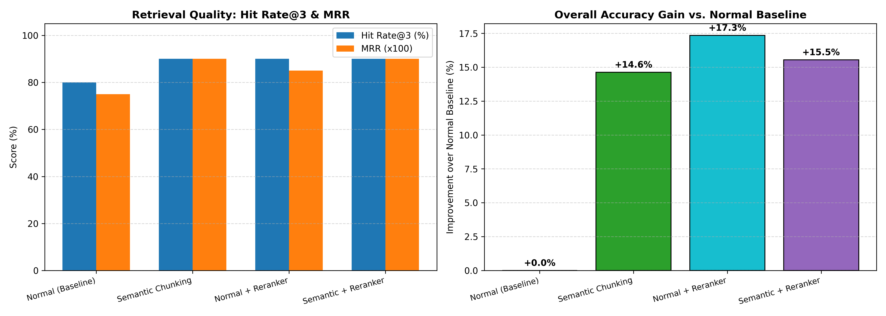

# RAG Chatbot

RAG Chatbot is an end-to-end research assistant powered by FastAPI, LangChain, Groq, and ChromaDB. It parses complex academic PDFs, extracts structured sections, generates summaries, and enables grounded conversational Q&A. It includes a benchmark suite evaluating semantic chunking and cross-encoder reranking across Hit Rate@3, MRR, and accuracy.

---

## Key Features

* **Interactive Web Application (`app.py`)**:
  * **Automated Section Segmentation**: Extracts raw text from uploaded PDFs, isolates sections, and refines section names using an LLM.
  * **On-Demand Summarization**: Generates granular, focused summaries for specific detected sections.
  * **Conversational Multi-Turn QA**: Context-grounded Q&A against the indexed document using memory and vector similarity search.
* **Retrieval & Accuracy Benchmarking (`benchmark.py`)**:
  * Evaluates 4 retrieval pipelines:
    1. **Fixed-Size (Character) Chunking (Baseline)**
    2. **Semantic Chunking** (`SemanticChunker` with distance percentile thresholds)
    3. **Character Chunking + Cross-Encoder Reranker** (`ms-marco-MiniLM-L-6-v2`)
    4. **Semantic Chunking + Cross-Encoder Reranker**
  * Computes **Hit Rate@3**, **Mean Reciprocal Rank (MRR)**, **LLM-Judged Factual Accuracy**, and **Query Latency**.
  * Automatically plots and saves evaluation bar charts (`normal_vs_semantic_benchmark.png`).

---

## Tech Stack

* **Backend & Web Framework**: FastAPI, Uvicorn, Jinja2, Pydantic
* **LLM Engine**: Groq Cloud API (`llama-3.1-8b-instant`)
* **Embedding Model**: `sentence-transformers/all-MiniLM-L6-v2` via `langchain-huggingface`
* **Reranker Model**: `cross-encoder/ms-marco-MiniLM-L-6-v2` via `sentence-transformers`
* **Vector Store**: ChromaDB (`langchain-chroma`)
* **Framework Orchestration**: LangChain, `langchain-experimental`, `langchain-text-splitters`
* **PDF Processing**: PyPDF2
* **Analytics & Visualization**: pandas, numpy, matplotlib

---

## Project Structure

```text
RAG-Chatbot/
│
├── app.py                            # FastAPI application server and routes
├── benchmark.py                      # RAG retrieval evaluation & benchmarking script
├── requirements.txt                  # Python dependencies
├── .env                              # Environment variables (API keys & models)
├── normal_vs_semantic_benchmark.png  # Generated benchmark visualization chart
├── templates/
│   └── index.html                    # Frontend user interface
├── static/                           # Static assets (CSS, JS, images)
├── uploads/                          # Stored PDF uploads
└── src/
    ├── load_and_extract_text.py      # PDF parsing and raw text extraction
    ├── detect_and_split_sections.py  # Section boundary detection and splitting
    ├── get_summary.py                # LLM-based section summarization logic
    ├── create_vector_db.py           # Document chunking and Chroma vector indexing
    └── RAG_retrival_chain.py         # QA and Conversational Retrieval chains
```

---

## Local Setup & Execution Guide

### Steps

```bash
# 1. Clone the repository and enter the directory
git clone [https://github.com/JagadeeshKandula135/RAG-Chatbot.git](https://github.com/JagadeeshKandula135/RAG-Chatbot.git)
cd RAG-Chatbot

# 2. Create and activate a virtual environment
python -m venv researchenv
# On Windows (PowerShell):
.\researchenv\Scripts\Activate.ps1
# On macOS/Linux:
# source researchenv/bin/activate

# 3. Install project dependencies
pip install -r requirements.txt

# 4. Create .env file with your API key and model configurations
echo "GROQ_API_KEY=your_actual_groq_api_key" > .env
echo "LLM_MODEL=llama-3.1-8b-instant" >> .env
echo "EMBEDDING_MODEL=sentence-transformers/all-MiniLM-L6-v2" >> .env

# 5. Start the web application
uvicorn app:app --reload --port 8000

# 6. Run the benchmark evaluation suite (optional)
python benchmark.py
```

---

## Benchmark Results & Visuals



* **Retrieval Quality (Panel 1)**: Compares Hit Rate@3 and Mean Reciprocal Rank (MRR) across character vs. semantic chunking and reranking.
* **Accuracy Gain (Panel 2)**: Visualizes the percentage improvement in answer factual accuracy relative to the fixed-size baseline.
